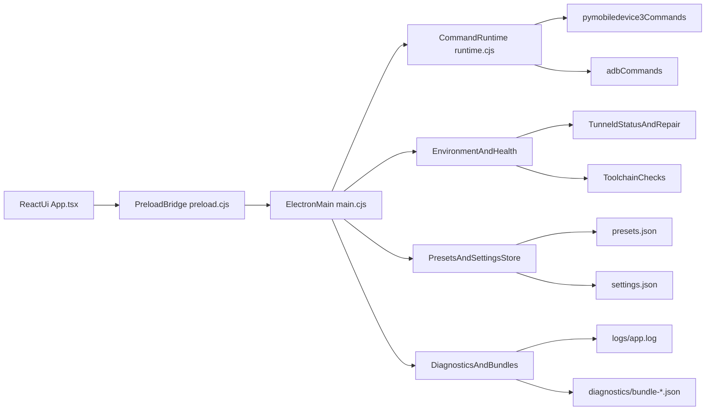
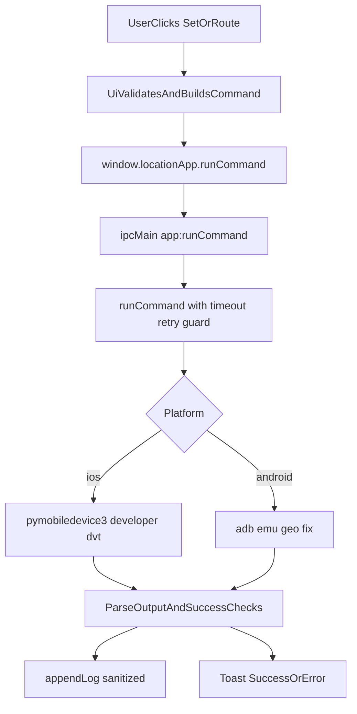

# Location Changer (Mac Phase 1 - iOS First)

Local desktop app for iOS/iPadOS and Android developer/testing location simulation, built with an adapter-first architecture so Windows can be added with minimal core rewrites.

## What is implemented

- Electron + React desktop app (`apps/desktop`)
- Core command contracts and simulation engine (`packages/core`)
- iOS adapter package (`packages/adapters/ios`) for teleport/route/stop command handling
- Android adapter package (`packages/adapters/android`) with emulator-first adb geo support
- Preset storage package (`packages/storage`)
- Diagnostics logger package (`packages/diagnostics`)
- Embedded OpenStreetMap picker with click-to-teleport and route polyline preview
- Saved places and saved routes with delete/import/export
- Toast/error center for command outcomes
- Connection health panel + tunnel repair actions
- Session settings persistence (platform mode, theme, map state, drafts)
- Diagnostics timeline filtering + diagnostics bundle export

## Architecture Diagram



## Command Flow



## Data Flow and Persistence

- `presets.json`: saved places and saved route templates
- `settings.json`: platform mode, theme, map center/zoom, last teleport and route draft, onboarding state, compact mode
- `app.log`: structured command and health events (sanitized IDs)
- `diagnostics/bundle-*.json`: exported support snapshots (environment + settings + logs + app metadata)

## Prerequisites (Mac)

- Node.js 20+
- Full Xcode installed in `/Applications/Xcode.app`
- Xcode developer directory set correctly:
  - `sudo xcode-select -s /Applications/Xcode.app/Contents/Developer`
  - verify with `xcode-select -p`
- Xcode license accepted:
  - `sudo xcodebuild -license accept`
- Python 3 + iOS developer tooling:
  - `pip3 install pymobiledevice3`
- iPhone/iPad connected and trusted by the Mac
- Android platform tools:
  - `adb` available on PATH
- Android emulator (recommended for geo fix support in this phase)

## Startup scripts (auto checks)

- `./start.sh` and double-click `start.command` now perform startup checks:
  - install npm dependencies when missing
  - verify Xcode path (`xcode-select -p`) and switch to full Xcode if available
  - verify `xcrun`
  - install `pymobiledevice3` via `pip3` if missing
  - install `adb` via Homebrew if missing (`brew install android-platform-tools`)
- If a dependency cannot be auto-installed (for example Xcode missing), the script prints the exact command to run.
- Tunnel mode:
  - default is external tunnel mode: `USE_EXTERNAL_TUNNEL=1`
  - in this mode, startup expects `tunneld` to already be running and healthy
  - to let `start.sh` manage tunnel itself, run with `USE_EXTERNAL_TUNNEL=0`

## Run locally

```bash
cd /Users/hbt/HarshithGowda/Apps/location-changer
# terminal A (keep this running)
sudo python3 -m pymobiledevice3 remote tunneld

# terminal B
./start.sh
```

Optional (legacy auto-managed tunnel):

```bash
USE_EXTERNAL_TUNNEL=0 ./start.sh
```

## Test commands

```bash
npm test
```

## Packaging and release

- Unsigned local DMG:
  - `npm run dist:mac:unsigned -w apps/desktop`
- Standard DMG build:
  - `npm run dist:mac -w apps/desktop`
- Signing/notarization prep docs:
  - see [`docs/release-signing-macos.md`](docs/release-signing-macos.md)

## Troubleshooting

- iOS detected but location not applied:
  - run tunnel in separate terminal and keep it open:
    - `sudo python3 -m pymobiledevice3 remote tunneld`
  - verify tunnel health:
    - `curl -fsS http://127.0.0.1:49151/`
  - reconnect iPhone (unplug/replug), unlock it, and accept trust prompts
- `No such option: --lat`:
  - update app to latest commit; current app uses positional args
- Android route not applying:
  - this phase supports emulator geo fix path (`adb emu geo fix`)
- Check diagnostics:
  - use in-app Diagnostics panel and export bundle

## Build all workspaces

```bash
npm run build
```

## Phase 1 iOS sign-off checklist

- [ ] Device shows connected/authorized/ready
- [ ] Teleport updates location to supplied point
- [ ] Route runs at least 10 minutes
- [ ] Stop halts updates and clears simulation
- [ ] Reconnect behavior works without restarting app
- [ ] Logs contain actionable error messages

## Monorepo layout

- `apps/desktop` Electron app and UI
- `packages/core` contracts + simulation engine
- `packages/adapters/ios` iOS adapter
- `packages/adapters/android` Android placeholder adapter
- `packages/storage` preset persistence
- `packages/diagnostics` structured logging
